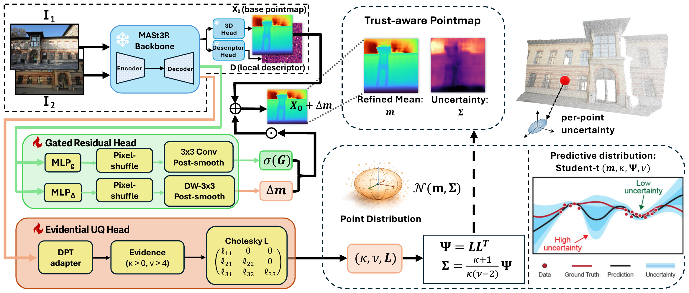

<div align="center">

# Trust3R: Evidential Uncertainty for Feed-Forward 3D Reconstruction

<p>
  <a href="https://trust3r-z.github.io/"></a>
  <a href="https://drive.google.com/file/d/1iwdfM5WN57wS6ZCsRzy18Tp0169-cc54/view?usp=sharing"></a>
  <a href="#bibtex"></a>
  
</p>

<p>
  <a href="https://scholar.google.com/citations?user=YfuA8zoAAAAJ&hl=en">Zihao Zhu</a><sup>*</sup>,
  <a href="https://wyzhao23.github.io/">Wenyuan Zhao</a><sup>*</sup>,
  <a href="https://nuochen1203.github.io/">Nuo Chen</a>,
  <a href="https://tiangroup.engr.tamu.edu/">Chao Tian</a><sup>&dagger;</sup>,
  <a href="https://phai-lab.github.io/index.html">Zhiwen Fan</a><sup>&dagger;</sup>
</p>

<p>Department of Electrical and Computer Engineering, Texas A&amp;M University</p>

<p><i>ICML 2026 — Seoul, South Korea</i></p>

<sub><sup>*</sup>Equal contribution &nbsp;·&nbsp; <sup>&dagger;</sup>Equal advising</sub>

<br>



</div>

---

## Overview

**Trust3R** turns a feed-forward 3D reconstructor (MASt3R / VGGT) into a model that not only
predicts geometry, but also tells you *where* that geometry can be trusted.
Starting from a frozen MASt3R backbone, we add two lightweight heads:

- **Evidential uncertainty head** — predicts the parameters of a Normal-Inverse-Wishart
  (NIW) prior `(κ, ν, Ψ = L Lᵀ)` over each 3D point. Marginalizing yields a closed-form
  multivariate Student-t predictive distribution, giving a calibrated per-pixel
  uncertainty map in a **single forward pass — no ensembles, no Monte Carlo sampling**.
- **Gated residual head** — produces small, gated corrections to the pretrained pointmap,
  perturbing it only where the model is uncertain enough to warrant it.

Trust3R consistently improves risk-coverage and sparsification on ScanNet++, TUM RGB-D,
KITTI, and ETH3D, with moderate inference overhead and no loss of geometric accuracy.

This repository ships the **core model, losses, training stack, and a minimal inference
script**. It deliberately omits checkpoints, visualization code, evaluation bundles,
Docker files, and demo apps so the release stays auditable and lightweight.

---

## Repository layout

```text
Trust3R/
├── assets/                       # README figures
├── mast3r/
│   ├── model.py                  # AsymmetricMASt3R wrapper
│   ├── catmlp_dpt_head.py        # NIG / NIW evidential 3D heads + gated residual head
│   ├── losses.py                 # MASt3R geometric / matching losses
│   └── losses_evidential.py      # NIG/NIW likelihoods + predictive variance helpers
├── dust3r/                       # vendored DUSt3R + CroCo (training/inference deps)
│   ├── dust3r/training.py        # training loop w/ Trust3R UQ controls
│   └── dust3r/inference.py       # batch forward + Trust3R uncertainty handling
├── scripts/                      # training launchers (env-var driven)
├── train.py                      # main training entry point
├── infer.py                      # minimal pair inference template
├── requirements.txt
├── LICENSE  ·  NOTICE  ·  CHECKPOINTS_NOTICE
└── README.md
```

---

## Installation

The code is tested on Linux + CUDA 12.1 + PyTorch 2.x + Python 3.11.

### 1. Clone the repo

```bash
git clone git@github.com:phai-lab/Trust3R.git
cd Trust3R
```

### 2. Create the conda environment

```bash
conda create -n trust3r python=3.11 cmake=3.14.0 -y
conda activate trust3r
```

### 3. Install PyTorch (match your CUDA)

```bash
# CUDA 12.1 example — adjust the cuda channel if your driver is different.
conda install pytorch torchvision pytorch-cuda=12.1 -c pytorch -c nvidia -y
```

### 4. Install the rest of the Python deps

```bash
pip install -r requirements.txt
```

`requirements.txt` re-exports `dust3r/requirements.txt` and adds `scikit-learn`, so the full
dependency set (torch, torchvision, roma, tqdm, opencv-python, scipy, einops, tensorboard,
huggingface-hub, scikit-learn) is installed in one shot.

### 5. (Optional) Build the RoPE CUDA kernels

These accelerate the CroCo attention with rotary positional embeddings. The code falls back
to a pure-PyTorch implementation if you skip this step.

```bash
cd dust3r/croco/models/curope
python setup.py build_ext --inplace
cd ../../../..
```

### 6. Get the pretrained MASt3R backbone

The training scripts use this checkpoint by default; the path is overridable via
`PRETRAINED=`.

```bash
mkdir -p checkpoints
wget https://download.europe.naverlabs.com/ComputerVision/MASt3R/MASt3R_ViTLarge_BaseDecoder_512_catmlpdpt_metric.pth \
     -P checkpoints/
```

> Trust3R checkpoints are **not** stored in git. Put your local checkpoints under
> `checkpoints/` and pass them through `PRETRAINED`, `OUT`, or `OUT_ROOT` (see below).

### Quick environment sanity check

```bash
python -c "from mast3r.model import AsymmetricMASt3R; print('Trust3R env OK')"
```

---

## Inference

`infer.py` is a minimal pair-forward template. It loads a Trust3R checkpoint,
runs the network on two images, and writes the raw output tensors so you can
extract whatever uncertainty summary you need.

```bash
python infer.py \
    --checkpoint checkpoints/trust3r_niw.pth \
    --img1 examples/a.jpg \
    --img2 examples/b.jpg \
    --image-size 512 \
    --output-dir infer_out/
```

The saved `infer_out/preds.pt` is a dict `{ 'pred1': ..., 'pred2': ... }`. Each `pred`
contains the standard MASt3R outputs (`pts3d`, `pts3d_in_other_view`, `conf`, descriptors)
plus the Trust3R NIW tensors. For an NIW checkpoint:

```python
import torch
out = torch.load("infer_out/preds.pt")
pred1 = out["pred1"]

kappa = pred1["xyz_niw_kappa"]   # (1, 1, H, W)  concentration of the mean
nu    = pred1["xyz_niw_nu"]      # (1, 1, H, W)  degrees of freedom
Psi   = pred1["xyz_niw_Psi"]     # (1, 3, 3, H, W) scale matrix (Psi = L L^T)

# Per-pixel predictive (total) variance — Student-t marginal of NIW.
trace_Psi = Psi[:, 0, 0] + Psi[:, 1, 1] + Psi[:, 2, 2]
total_var = trace_Psi / (kappa.squeeze(1) * (nu.squeeze(1) - 4.0).clamp_min(1e-3))
```

Exact key names may vary slightly between head variants (NIW vs. NIG). The script
prints the full key list on every run so you can adapt to your checkpoint.

---

## Training

Trust3R training is split into two stages and is fully **environment-variable driven** —
no need to edit the launcher to change paths, GPU id, or hyperparameters.

### Required dataset roots

The training scripts assume the standard DUSt3R-preprocessed dataset layout:

| Variable        | Dataset                  |
|-----------------|--------------------------|
| `SCANNET_ROOT`  | ScanNet++ (preprocessed) |
| `ARKIT_ROOT`    | ARKitScenes              |
| `WAYMO_ROOT`    | Waymo                    |
| `MEGA_ROOT`     | MegaDepth                |

### Common overrides

```bash
GPU=0                   # CUDA_VISIBLE_DEVICES
PORT=29652              # torch.distributed rendezvous port
PRETRAINED=checkpoints/MASt3R_ViTLarge_BaseDecoder_512_catmlpdpt_metric.pth
TRAIN_N=150000          # pairs per training epoch
VAL_N=2000              # pairs per validation epoch
BATCH_GLOBAL=10         # global batch size
RES=448                 # input resolution
LAMBDA_UQ_XYZ=0.05      # NIW Student-t NLL weight
LAMBDA_EVI_XYZ=1e-3     # NIW evidence regularizer weight
```

### Trust3R-NIW (Normal-Inverse-Wishart, full 3D covariance)

```bash
GPU=0 \
SCANNET_ROOT=/path/to/scannetpp_processed \
ARKIT_ROOT=/path/to/arkitscenes_processed \
WAYMO_ROOT=/path/to/waymo_processed \
MEGA_ROOT=/path/to/megadepth_processed \
bash scripts/run_gated_niw_train_grpost.sh
```

### Trust3R-NIG (Normal-Inverse-Gamma, diagonal variance)

```bash
GPU=0 \
SCANNET_ROOT=/path/to/scannetpp_processed \
ARKIT_ROOT=/path/to/arkitscenes_processed \
WAYMO_ROOT=/path/to/waymo_processed \
MEGA_ROOT=/path/to/megadepth_processed \
bash scripts/run_gated_nig_train_grpost.sh
```

### Other launchers

| Script                                          | What it trains |
|-------------------------------------------------|----------------|
| `scripts/run_gated_niw_train.sh`                | NIW UQ head, no gated-residual post-smoother |
| `scripts/run_gated_nig_train.sh`                | NIG UQ head, no gated-residual post-smoother |
| `scripts/run_gated_niw_train_grpost_uc_resume.sh` | Resume from the NIW + GR-post checkpoint and refine UC |
| `scripts/run_hetero_train.sh`                   | Heteroscedastic Gaussian baseline |
| `scripts/run_ens_parallel.sh`                   | Deep-ensemble baseline (set `GPUS_STR=0,1,2,3 K=10`) |

Outputs land under `output*/` and are git-ignored. Checkpoints, TensorBoard logs, and
optimizer states are written there.

---

## Method at a glance

| Component | File | What it does |
|-----------|------|--------------|
| Trust3R model wrapper | [`mast3r/model.py`](mast3r/model.py) | Subclasses `AsymmetricCroCo3DStereo`, swaps in the NIW / NIG / GR heads. |
| NIW / NIG evidential heads | [`mast3r/catmlp_dpt_head.py`](mast3r/catmlp_dpt_head.py) | Adds a parallel DPT head producing `(κ, ν, L)` and the gated residual `(Δm, σ(G))`. |
| Evidential losses | [`mast3r/losses_evidential.py`](mast3r/losses_evidential.py) | Student-t NLL under the NIW/NIG marginal + evidence regularizer. |
| Geometric + matching losses | [`mast3r/losses.py`](mast3r/losses.py) | MASt3R `Regr3D` / `InfoNCE` / `MatchingLoss` used by the geometry stage. |
| Training loop | [`dust3r/dust3r/training.py`](dust3r/dust3r/training.py) | Stage-aware optimizer groups, geometry-freezing, GR-post warmup. |
| Forward + UQ | [`dust3r/dust3r/inference.py`](dust3r/dust3r/inference.py) | Batched forward and Trust3R uncertainty bookkeeping. |
| Pair inference template | [`infer.py`](infer.py) | One-shot pair forward, dumps `pred1 / pred2` tensors. |

---

## BibTeX

```bibtex
@inproceedings{zhu2026trust3r,
  title     = {Trust3{R}: Unifying Feed-Forward Pointmap Prediction
               and Evidential Learning for Trust-Aware {3D} Reconstruction},
  author    = {Zhu, Zihao and Zhao, Wenyuan and Chen, Nuo and
               Tian, Chao and Fan, Zhiwen},
  booktitle = {Proceedings of the 43rd International Conference
               on Machine Learning (ICML)},
  series    = {Proceedings of Machine Learning Research},
  volume    = {306},
  year      = {2026},
  publisher = {PMLR},
}
```

---

## Acknowledgements

This codebase builds directly on the excellent
[MASt3R](https://github.com/naver/mast3r),
[DUSt3R](https://github.com/naver/dust3r),
and [CroCo](https://github.com/naver/croco) releases from Naver Labs Europe.
We thank the authors for open-sourcing their work.

## License

Trust3R is released under **CC BY-NC-SA 4.0** (non-commercial use only), inherited from
MASt3R / DUSt3R / CroCo. See [`LICENSE`](LICENSE), [`NOTICE`](NOTICE),
[`dust3r/LICENSE`](dust3r/LICENSE), and [`dust3r/croco/LICENSE`](dust3r/croco/LICENSE)
for the full terms.
